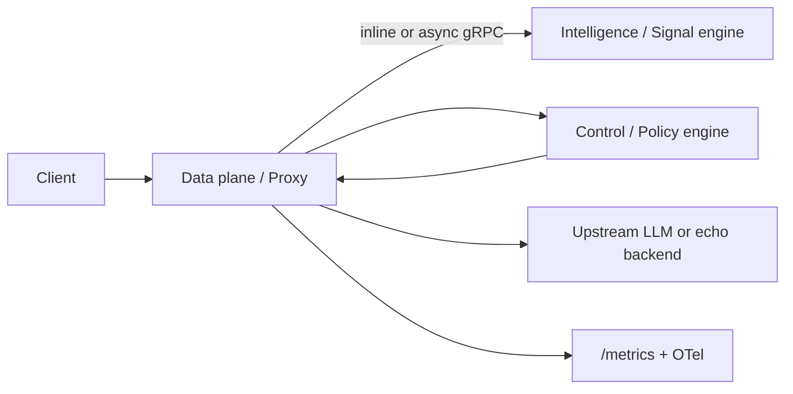
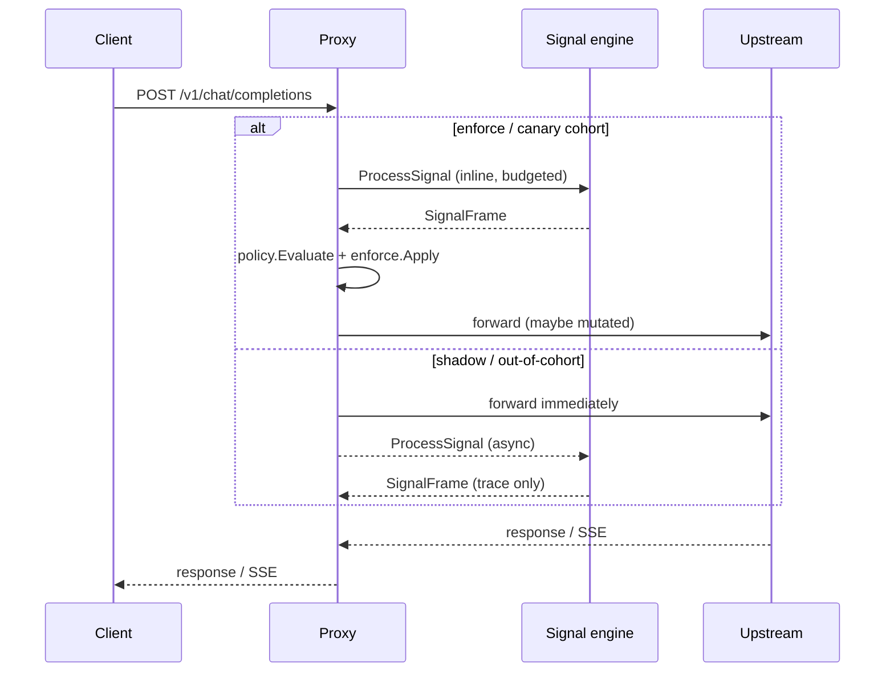

# HSAR Architecture Overview

HSAR is a **runtime governance control plane** that sits between users and foundation models. It forecasts human-interaction failure risk using CPU-only signal inference and applies bounded, deterministic controls—without retraining models or blocking the data plane when things go wrong.

This document is the curated narrative for evaluators. For an implementation snapshot, see [`current_architecture.txt`](../current_architecture.txt). For policy FSM details, see [policy-engine.md](policy-engine.md).

---

## Overview

HSAR runs as a **fail-open sidecar proxy**. Every chat completion request enters the Go data plane; perception and policy run inline (enforce/canary) or asynchronously (shadow). If HSAR exceeds its latency budget or any governance step fails, the original request forwards unchanged.

---

## Three planes

| Plane | Runtime | Responsibility |
|-------|---------|----------------|
| **Data** | Go proxy (`cmd/proxy`) | Ingress, tenant auth, rate limits, inline/shadow governance, upstream SSE forwarding, Prometheus `/metrics`, optional OTel traces |
| **Intelligence** | Python signal engine | ONNX `failure_risk` inference over gRPC `ProcessSignal`; abstention when confidence is low |
| **Control** | Go policy engine (`internal/policy`) | Versioned YAML rules, hysteresis/cooldown FSM, action application (`internal/proxy/enforce`) |

---

## Request lifecycle

All modes share: auth → optional rate limit → governance path → upstream forward → response.

### Shadow (`MODE=shadow`)

1. Proxy accepts `POST /v1/chat/completions`.
2. **Async goroutine** calls signal engine (off critical path).
3. Policy evaluates counterfactual decision; `policy_trace` logged with `enforce_applied=false`.
4. Request body forwarded to upstream **without mutation**.

### Canary (`MODE=canary`, `CANARY_PCT>0`)

1. Requests in canary cohort (deterministic by `X-Request-ID`) take the **inline enforce path**.
2. Out-of-cohort requests follow the shadow path only.

### Enforce (`MODE=enforce`)

1. **Inline governance** runs synchronously with ≤30 ms budget.
2. Signal engine called inline; policy evaluates; actions may mutate the request or short-circuit.
3. `policy_trace` logged with `enforce_applied=true` when mutation attempted.
4. Forward (possibly mutated) request to upstream.

---

## Fail-open guarantees

| Trigger | User-visible behavior | Validated by |
|---------|----------------------|--------------|
| Inline budget exceeded | Original body forwarded | `make test`, `make smoke` |
| Perception gRPC error / timeout | Original body forwarded | `make smoke` (engine stopped), `make bench-chaos` |
| Policy evaluation error | Original body forwarded | `make test` |
| Abstention (`abstain=true`) | Passthrough, no mutation | `make test` |
| Kill switch (`ENFORCE_KILL_SWITCH=true`) | Passthrough; traces continue | `make test`, [runbook.md](runbook.md) |
| Shadow async failure | No effect on main path | `make smoke` |

Measured runtime proof: [benchmarks.md — Runtime SLOs](benchmarks.md#runtime-slos-proxy-load--chaos) (load added latency + chaos fail-open success).

---

## Observability

- **Metrics**: Prometheus histograms/counters at `GET /metrics` (inline latency, fail-open, abstain, actions, policy duration).
- **Traces**: Optional OTel GenAI-aligned spans (privacy allowlist—no message bodies).
- **Structured logs**: `policy_trace`, `signal_engine_signalframe` (IDs and enums only).

Import dashboard: [`dashboards/hsar.json`](../dashboards/hsar.json). Start stack: `make up-observability`.

---

## Enforcement code map

For engineers who want source pointers (main narrative above uses validation artifacts only):

| Guarantee | Primary code | Tests / harness |
|-----------|--------------|-----------------|
| Fail-open inline | `internal/proxy/inline.go` | `internal/proxy/inline_test.go`, `make smoke` |
| Shadow async non-blocking | `internal/proxy/shadow.go` | `make smoke` |
| Policy evaluation | `internal/policy/evaluator.go` | `internal/policy/evaluator_test.go` |
| Action application | `internal/proxy/enforce.go` | `internal/proxy/enforce_test.go` |
| Privacy-safe `policy_trace` | `internal/policy/trace.go` | `internal/engine/client_test.go` |
| Telemetry allowlist | `internal/telemetry/metrics_test.go`, `internal/telemetry/otel_test.go` | `make test` |
| Kill switch | `internal/config/config.go`, `internal/proxy/inline.go` | `make test` |
| Chaos fail-open under load | `bench/chaos.sh` | `make bench-chaos` |

---

## Related documentation

- [Policy engine design](policy-engine.md) — FSM, modes, kill switch
- [Threat model](threat-model.md) — trust boundaries and privacy
- [Benchmarks](benchmarks.md) — model metrics + Runtime SLOs
- [Runbook](runbook.md) — enforce rollout and operations
- [Demo](demo.md) — `make demo` walkthrough
- [failure_risk model card](../signal-engine/models/failure_risk/model_card.md)