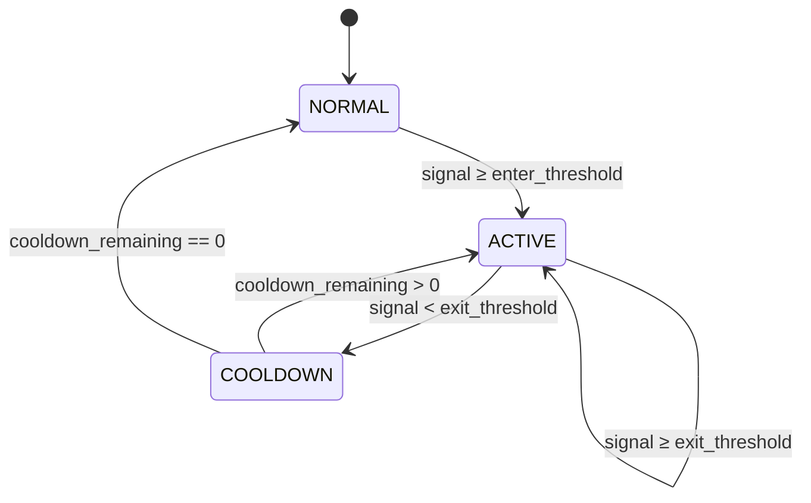

# Policy Engine (Phase 3)

The policy engine evaluates counterfactual governance decisions from `SignalFrame` outputs. In Phase 3 it runs in **shadow mode only** — it logs `policy_trace` records without mutating upstream requests or responses.

## Control loop

```text
Request → Shadow goroutine
            ├─ gRPC ProcessSignal → SignalFrame
            ├─ policy.Evaluate(frame, conversationKey) → Decision
            └─ slog.Info("policy_trace", ...) → PolicyTrace log
```

The user-facing path never waits on policy evaluation. If signal inference or policy evaluation fails, the request still passes through unchanged (fail-open).

## FSM (hysteresis + cooldown)

Policy stability uses a per-conversation finite state machine keyed by `tenant_id + ":" + conversation_id`.



| State | Meaning |
|-------|---------|
| `NORMAL` | No active governance |
| `HYSTERESIS_ENTRY` | Transient entry (same evaluation as ACTIVE) |
| `ACTIVE` | Matched rule action applies counterfactually |
| `COOLDOWN` | Signal dropped below exit; hold active for N requests |

**Anti-flap**: `enter_threshold > exit_threshold` creates a hysteresis band. Once ACTIVE, oscillation near thresholds does not repeatedly re-enter from NORMAL until cooldown completes.

## Conversation key

```text
conversation_id = X-Conversation-ID header
                 OR X-Request-ID (fallback)
state_key       = tenant_id + ":" + conversation_id
```

## Declarative policy

Policies are versioned YAML files loaded at proxy startup (`POLICY_PATH`, default `policies/standard-safety-policy.yaml`). Invalid or missing policy files cause fail-fast startup.

Example rule:

```yaml
policy_id: standard-safety-policy
policy_version: v1.0.0
cooldown_requests: 3
rules:
  - signal: failure_risk
    enter_threshold: 0.75
    exit_threshold: 0.55
    action: INJECT_SYSTEM_CONTEXT
```

Rules are evaluated top-to-bottom; the first rule with a readable signal value wins.

## PolicyTrace log

Each shadow evaluation emits structured JSON:

```json
{
  "msg": "policy_trace",
  "trace_id": "<request-id>",
  "tenant_id": "<tenant>",
  "decision_id": "<uuid>",
  "policy_id": "standard-safety-policy",
  "policy_version": "v1.0.0",
  "stability_state": "STATE_ACTIVE",
  "actions": [{"type": "ACTION_INJECT_SYSTEM_CONTEXT", "detail": "..."}]
}
```

No raw user content appears in traces.

## Action strength (monotonicity)

For property tests and safety reasoning, actions have a fixed strength ordering:

`PASSTHROUGH(0) < DAMPEN_VERBOSITY(1) < INJECT_SYSTEM_CONTEXT(2) < ESCALATE_HUMAN(3) < BLOCK_UNSAFE(4)`

Higher `failure_risk` should not produce a weaker action than a lower risk in the same policy.

## Phase boundaries

| Phase | Behavior |
|-------|----------|
| Phase 3 (now) | Shadow counterfactual traces only |
| Phase 4 (planned) | Enforce mode — apply actions to requests/responses |