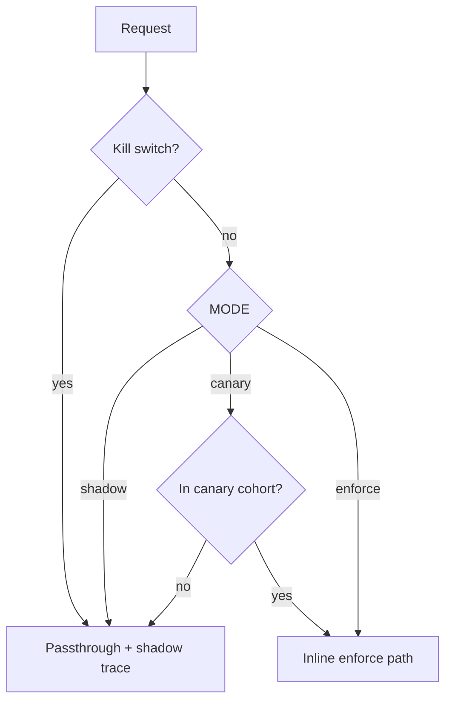
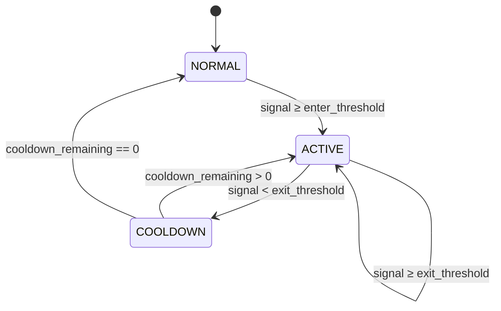

# Policy Engine (Phase 3–4)

The policy engine maps `SignalFrame` outputs to bounded governance actions via versioned YAML rules and a hysteresis/cooldown FSM.

## Modes

| MODE | Behavior |
|------|----------|
| `shadow` | Async counterfactual `policy_trace` only; no request mutation |
| `canary` | Inline enforce on `CANARY_PCT`% of requests (deterministic by `X-Request-ID`); shadow async for out-of-cohort |
| `enforce` | Inline signal + policy + action application on all qualifying requests |

Set `ENFORCE_KILL_SWITCH=true` to instantly disable all enforcement mutations (passthrough + traces continue).

## Shadow control loop (Phase 3)

```text
Request → Shadow goroutine (async)
            ├─ gRPC ProcessSignal → SignalFrame
            ├─ policy.Evaluate(frame, conversationKey) → Decision
            └─ slog.Info("policy_trace", enforce_applied=false)
```

## Inline enforce loop (Phase 4)

```text
Request → InlineGovernance middleware (≤30ms budget)
            ├─ InlineGetSignals → SignalFrame
            ├─ policy.Evaluate → Decision
            ├─ enforce.ApplyActions → mutate body or short-circuit
            └─ slog.Info("policy_trace", enforce_applied=true|false)
          → Upstream (or direct response on escalate/block)
```

Fail-open triggers (forward original body unchanged):

- Budget exceeded
- gRPC / perception error
- `abstain=true` or passthrough decision
- Kill switch active

## Rollout gating



Canary cohort: `fnv32(request_id) % 100 < CANARY_PCT`

## FSM (hysteresis + cooldown)

Policy stability uses a per-conversation finite state machine keyed by `tenant_id + ":" + conversation_id`.



## Enforcement actions

| Action | Effect |
|--------|--------|
| `INJECT_SYSTEM_CONTEXT` | Prepend system message from policy `detail` |
| `DAMPEN_VERBOSITY` | Clamp `max_tokens`; add terse system hint |
| `ESCALATE_HUMAN` | Short-circuit 200 handover JSON (no upstream) |
| `BLOCK_UNSAFE` | Short-circuit 400 explicit error (no silent drop) |
| `PASSTHROUGH` | No mutation |

## Declarative policy

Policies load at startup from `POLICY_PATH` (default `policies/standard-safety-policy.yaml`). Rules are ordered highest `enter_threshold` first; the first rule whose signal value meets `enter_threshold` wins.

## PolicyTrace log

```json
{
  "msg": "policy_trace",
  "trace_id": "<request-id>",
  "enforce_applied": true,
  "policy_id": "standard-safety-policy",
  "stability_state": "STATE_ACTIVE",
  "actions": [{"type": "ACTION_DAMPEN_VERBOSITY", "detail": "max_tokens=128"}]
}
```

No raw user content appears in traces.

## Related documentation

- [Architecture overview](architecture.md) — three planes and request lifecycle
- [Threat model](threat-model.md) — governance action abuse and privacy
- [Runbook](runbook.md) — enforce rollout and kill switch
- [Demo](demo.md) — `make demo` walkthrough