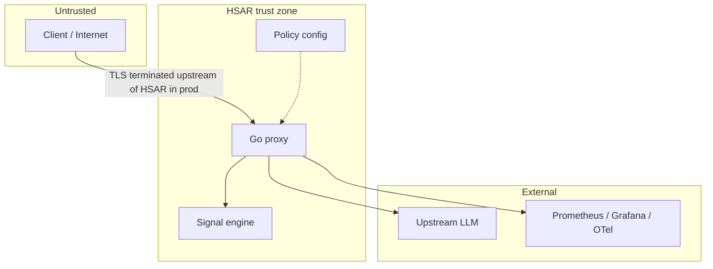

# HSAR Threat Model

Structured security analysis for HSAR as an **in-path AI gateway**. Scope: local/single-deployment Compose stack; production hardening (mTLS, signed policies, WAF) is out of scope for this MVP but noted as residual risk.

**Out of scope for HSAR itself**: content-level guardrails (jailbreak detection, toxicity, PII scanning). HSAR forecasts **interaction failure risk** and applies bounded governance—not NeMo Guardrails / Lakera-style content safety. Deploy separate tooling if that threat class matters.

---

## Assets

| Asset | Sensitivity | Notes |
|-------|-------------|-------|
| User prompts & model responses | High | Transit through proxy; not stored in telemetry |
| Tenant API keys | High | `Authorization: Bearer` → tenant ID |
| Policy YAML | Medium | Drives escalate/block/inject behavior |
| Telemetry exports | Medium | Must not contain raw content |
| Upstream credentials | High | Configured on proxy, not in repo |

---

## Trust boundaries

| Boundary | HSAR trusts | HSAR must not trust |
|----------|-------------|---------------------|
| Client → Proxy | Bearer token format | Client-supplied tenant IDs, prompt intent |
| Proxy → Engine | gRPC contract | Engine availability (fail-open) |
| Proxy → Upstream | TLS to configured base URL | Upstream response safety |
| Proxy → Observability | Local collector config | Collector availability (fail-silent export) |

---

## Data handling & privacy

**Transits the proxy**: full request/response bodies for forwarding only.

**Never exported in traces, metrics, or structured logs**:

- `messages`, `content`, `text_payload`, response bodies
- Per-request IDs as **high-cardinality metric labels** (allowed in trace/log correlation only)

**Enforcement layers** (verifiable in repo):

1. **Telemetry allowlist tests** — `internal/telemetry/metrics_test.go`, `internal/telemetry/otel_test.go` deny `messages`, `content`, `prompt`, `text_payload` in exported payloads.
2. **PolicyTrace shape** — `internal/policy/trace.go` logs IDs, policy metadata, action enums, and `enforce_applied`—never message bodies.
3. **Constitution** — Privacy-by-Design principle III in project governance; contributors see [CONTRIBUTING.md](../CONTRIBUTING.md).

---

## Threat catalog (STRIDE-lite)

| ID | Category | Threat | Mitigation | Residual risk |
|----|----------|--------|------------|---------------|
| T1 | Spoofing | Stolen API key used against proxy | Bearer auth; per-tenant keys; 401 without key (`make smoke`) | Default `dev-key-1` in Compose is not production-safe |
| T2 | Tampering | Attacker modifies policy YAML on disk | File mounted in container; version in `policy_trace` | No signed policies or admission control in MVP |
| T3 | Information disclosure | Prompt content in metrics/traces | Allowlist tests + PolicyTrace denylist | Operator misconfiguration of custom log fields |
| T4 | Denial of service | Traffic flood to proxy | Per-tenant rate limits (429 tested) | No edge WAF; single-replica Compose |
| T5 | Elevation | Misconfigured `BLOCK` / `ESCALATE` harms users | Canary rollout, kill switch, runbook warnings | Operator skips canary |
| T6 | Supply chain | Vulnerable Go/Python dependency | `govulncheck`, `buf lint`, CI on every push | Third-party ONNX runtime trust |
| T7 | Repudiation | Deny governance action was applied | `policy_trace` with `decision_id`, `policy_version` | Logs not immutably stored |

---

## Prompt injection stance

HSAR **does not** treat prompt injection as an in-scope mitigation. Adversarial prompts may still reach the upstream model. HSAR signals **failure-risk patterns** (frustration, escalation trajectory) and applies **bounded actions** (inject calm system context, dampen verbosity, escalate, block per policy).

Combine HSAR with content guardrails and upstream safety filters for defense in depth.

---

## Multi-tenant isolation

- API key maps to `tenant_id` in auth middleware.
- Rate limits are per-tenant (`TENANT_RATE_RPS`).
- Policy traces include `tenant_id`; no cross-tenant policy file in MVP (single shared YAML).

**Residual**: Shared policy across tenants in default deployment—production should use per-tenant policy mounts.

---

## Governance action abuse

| Action | Abuse scenario | Controls |
|--------|----------------|----------|
| `INJECT_SYSTEM_CONTEXT` | Over-aggressive tone forcing | Thresholds + FSM hysteresis; shadow mode first |
| `DAMPEN_VERBOSITY` | Unexpected `max_tokens` cap | Policy version in trace; canary |
| `ESCALATE_HUMAN` | False-positive routing | Kill switch; fail-open on errors |
| `BLOCK_UNSAFE` | False blocks | Kill switch; highest threshold in policy |

Operational controls: [runbook.md](runbook.md) (canary before enforce, kill switch verification).

---

## Residual risks (top 3)

1. **Dev credentials in Compose** — `dev-key-1` must be rotated for any shared environment.
2. **No content-level injection defense** — requires complementary guardrails.
3. **Single shared policy file** — tenant blast radius not isolated in MVP.

---

## Related documentation

- [Architecture](architecture.md) — planes and fail-open
- [Policy engine](policy-engine.md) — actions and FSM
- [Runbook](runbook.md) — safe enforce rollout
- [CONTRIBUTING.md](../CONTRIBUTING.md) — CI supply-chain checks